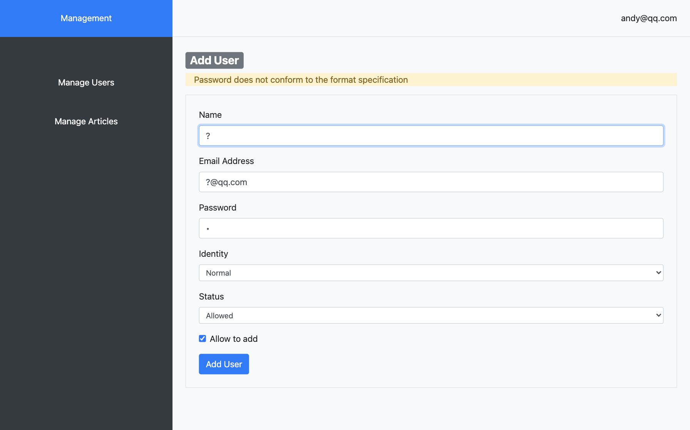
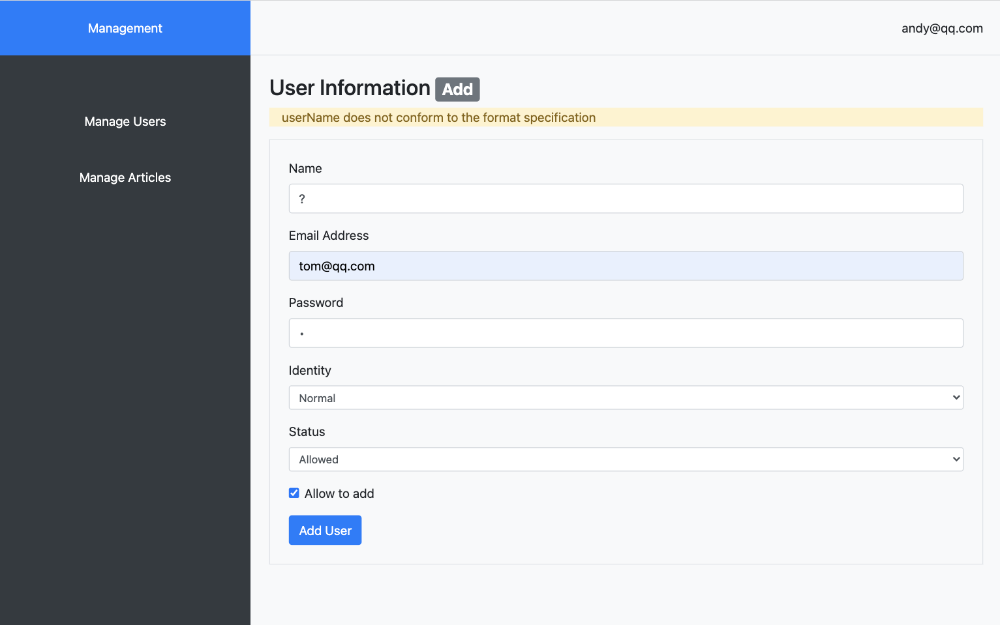

## Blog and Users Management

**SSR**(Server Side Rendering) Blogs and Users' Infomation Management

---

### Directory Detail

```js
|- model  // set database
    |-connect.js // connect to Mongodb
    |- user.js // add user
|- public  // static resource
    |- images
    |- css
    |- js
        |- common.js // handel login form
|- route  // routes
    |- home.js  //
    |- admin.js  // manage routes /admin/???
    |- admin
        |- addArticlePageRender.js 
        |- addUserPageRender.js 
        |- editArticlePageRender.js  
        |- editArticlePageRender.js 
        |- articleListPageRender.js 
        |- userListPageRender.js  // for Super User
        |- loginPageRender.js
        |- addUser.js
        |- login.js        
        |- logout.js
|- views  // templates of art-template
    |- common
        |- header.art  // top nav
        |- aside.art   // left nav
        |- layout/art  // HTML bone
    |- admin
        |- login.art
        |- users.art  // users list page
        |- articles.art  // articles  page
        |- add-user.art  // add
        |- add-article.art  // add
        |- edit-user.art  // edit
        |- edit-article.art  //edit
        |- error.art // login error page
|- index.js  // mian JS file
|- package.json
|- package-lock.json
```

---

### Tech Stack
- Bootstap v4

- Node.js

- Express.js

- MongeDB

- art-template(express-art-template)

- bcrypt

- session(express-session)

- Joi

---

## Start Project
```bash
npm install 

nodemon index.js
```

**SSR Server running at localhost:80**


localhost/admin/login

**Super User**: 
- email: andy@qq.com 
- password: 123456

```js
// created the first user(init Super User)
/*
 function createTextUser() {
   User.create({
     username: "Andy",
     email: "andy@qq.com",
     password: "123456",
     identity: "admin",
     status: 0,
   })
     .then(() => {console.log("new user is created")})
     .catch(() => {console.log("falied to create a new user")})
 }
 createTextUser();
 */

// created the first user by bcrypt
async function createTextUser() {
  // bcrypt
  const bcrypt = require("bcrypt");
  const salt = await bcrypt.genSalt(10);
  const pass = await bcrypt.hash("123456", salt);
  User.create({
    username: "Andy",
    email: "andy@qq.com",
    password: pass,
    identity: "admin",
    status: 0,
  })
    .then(() => {console.log("new user is created")})
    .catch(() => {console.log("falied to create a new user")});
}
createTextUser();
```

---

localhost/admin/users


---

localhost/admin/articles


---

localhost/admin/add/user

```js
// Joi
const Joi = require('joi')
// add user
module.exports = async (req, res) => {
    // Joi rules
    const schema = {
        username: Joi.string()
            .min(2).max(25)
            .required()
            .error(new Error('userName does not conform to the format specification')),
        email: Joi.string()
            .email()
            .required()
            .error(new Error('Email does not conform to the format specification')),
        password: Joi.string()
            .regex(/^[0-9a-zA-Z]{3,30}$/)
            .required()
            .error(new Error('Password does not conform to the format specification')),
        identity: Joi.string()
            .valid('normal', 'admin')
            .required()
            .error(new Error('Identity does not conform to the format specification')),
        status: Joi.number()
            .valid(0, 1)
            .required()
            .error(new Error('Status does not conform to the format specification'))
    };
    
    try {
        // validate
        await Joi.validate(req.body, schema)
    } catch (err) {
        // if failed
        res.redirect(`/admin/add/user?message=${err.message}`)
    }
}
```
---

localhost/admin/edit/user

