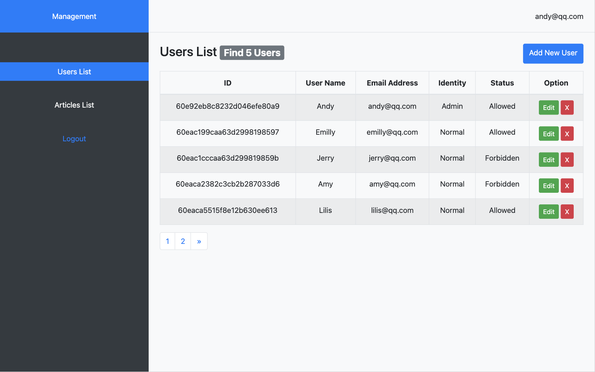
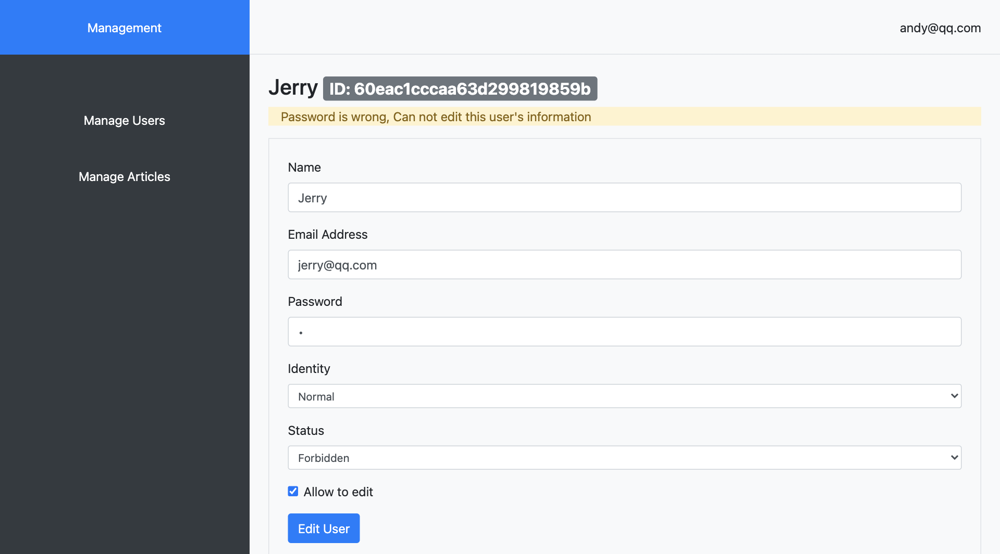
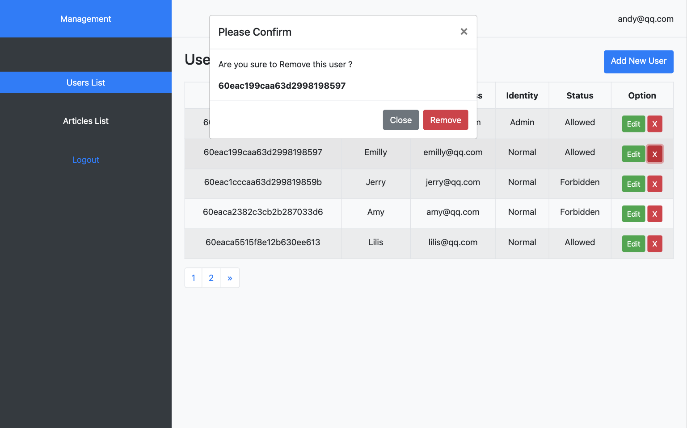
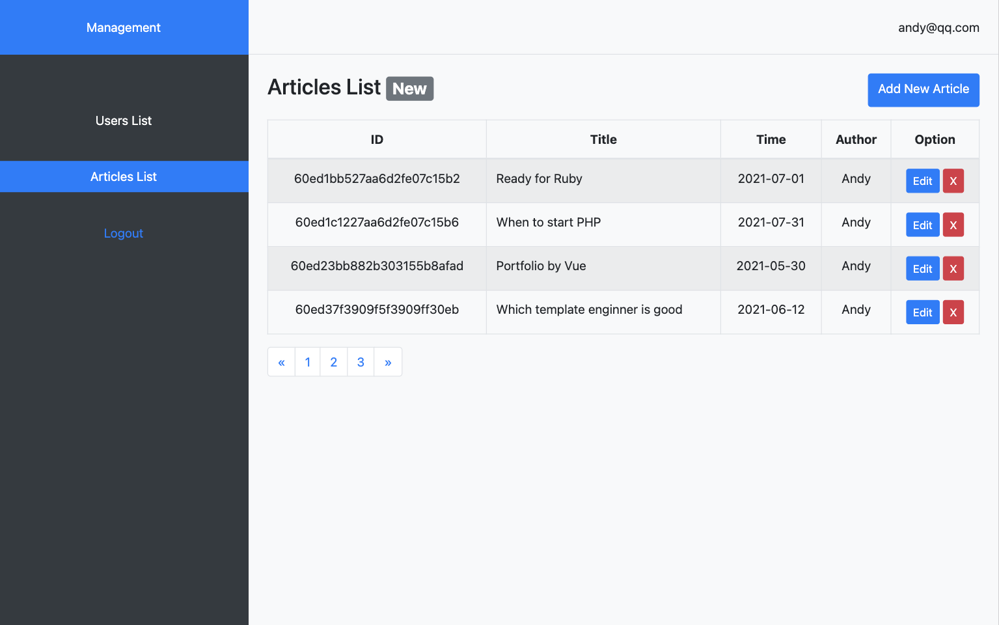

## Blogs and Users Management
a full stack project.

Blogs and Users' Infomation Management system, according to Express.js + MongoDB + TemplateEngine. Server Side Rendering **(SSR)** 

could check and uploade blog articles,
login as admin to manage users and articles

**Start Project**
```bash
npm install 

nodemon index.js
```
**SSR Server running at localhost:80**

---

### 1. Function
- **Client**
    - check blogs
    - check artic details
    - uploade blog article
    - login
    - logout
    - check static resources on server
- **Server**
    - http server created by Express.js
    - connect to database, add/edit/remove data
    - SSR, Server Side Rendering by TemplateEngine
    - route guard login interception
    - use session + cookie to record login
    - use Joi to validate form data from client side
    - use formidable to analyze files uploaded from client side
    - use bcrypt password-hashing encryption
 

---
### 2.Tech Stack

- **front end**: 
    - HTML5 + CSS3
    - Bootstrap 4
    - jQuery
    - CKEditor
- **server side**: 
    - Node.js
    - **Express.js** 
    - art-template
    - express-art-template
    - mongoose
    - bcrypt
    - session(express-session)
    - Joi
    - body-parser
    - formidable
    - dateformat
- **database**: 
    - **MongoDB**
    - MongoDB Compass

---

### 3. Directory Detail

```js
|- middleware
    |- loginGuard.js // login interception
|- model  // set database
    |-connect.js // connect to Mongodb
    |- user.js // add user
|- public  // static resource
    |- images
    |- uplaods // blog articles' cover img
    |- css
    |- js
        |- common.js // handel login form
        |- ckeditor.js 
|- route  // routes
    |- home.js  //
    |- admin.js  // manage routes /admin/???
    |- admin
        |- addArticlePageRender.js 
        |- addUserPageRender.js 
        |- editArticlePageRender.js  
        |- editArticlePageRender.js 
        |- articleListPageRender.js 
        |- userListPageRender.js  // for Super User
        |- loginPageRender.js
        |- addUser.js
        |- editUser.js
        |- removeUser.js
        |- login.js        
        |- logout.js
    |- home
        |- home.js
        |- articleDetail.js
|- views  // templates of art-template
    |- admin
        |- common
            |- header.art  // top nav
            |- aside.art   // left nav
            |- layout/art  // HTML bone
        |- login.art
        |- users.art  // users list page
        |- articles.art  // articles  page
        |- add-user.art  // add
        |- add-article.art  // add
        |- edit-user.art  // edit
        |- edit-article.art  //edit
        |- error.art // login error page
    |- home
        |- common
            |- header.art  // top nav
            |- layout/art  // HTML bone    
        |- index.art // home
        |- article.art // article's detail
|- index.js  // mian JS file
|- package.json
|- package-lock.json
```

---

## 4. Routes
- `/home/`: home page, bolg articles list

- `/admin/login `: user login to manage 
- `/admin/logout `: user logout

- `/admin/users`: users' list
- `/admin/add/user `: add new user
- `/admin/edit/user `: modify user's data

- `/admin/remove/user`: remove user
- `/admin/articles`: articles list
- `/admin/add/articles`: add new article
- `/admin/edit/articles `: modify article
- `/admin/remove/articles `: remove article

---
/admin/login

**Super User**: 
- email: andy@qq.com 
- password: 123456

```js
// created the first user(init Super User)
/*
 function createTextUser() {
   User.create({
     username: "Andy",
     email: "andy@qq.com",
     password: "123456",
     identity: "admin",
     status: 0,
   })
     .then(() => {console.log("new user is created")})
     .catch(() => {console.log("falied to create a new user")})
 }
 createTextUser();
 */

// created the first user by bcrypt
async function createTextUser() {
  // bcrypt
  const bcrypt = require("bcrypt");
  const salt = await bcrypt.genSalt(10);
  const pass = await bcrypt.hash("123456", salt);
  User.create({
    username: "Andy",
    email: "andy@qq.com",
    password: pass,
    identity: "admin",
    status: 0,
  })
    .then(() => {console.log("new user is created")})
    .catch(() => {console.log("falied to create a new user")});
}
createTextUser();
```

---

/admin/users


---

/admin/add/user


```js
// Joi
const Joi = require('joi')
// add user
module.exports = async (req, res) => {
    // Joi rules
    const schema = {
        username: Joi.string()
            .min(2).max(25)
            .required()
            .error(new Error('userName does not conform to the format specification')),
        email: Joi.string()
            .email()
            .required()
            .error(new Error('Email does not conform to the format specification')),
        password: Joi.string()
            .regex(/^[0-9a-zA-Z]{3,30}$/)
            .required()
            .error(new Error('Password does not conform to the format specification')),
        identity: Joi.string()
            .valid('normal', 'admin')
            .required()
            .error(new Error('Identity does not conform to the format specification')),
        status: Joi.number()
            .valid(0, 1)
            .required()
            .error(new Error('Status does not conform to the format specification'))
    };
    
    try {
        // validate
        await Joi.validate(req.body, schema)
    } catch (err) {
        // if failed
        res.redirect(`/admin/add/user?message=${err.message}`)
    }
}
```

---

/admin/eddit/user


---

/admin/remove


---

/admin/articles


---

/admin/add/article


---

/home/
